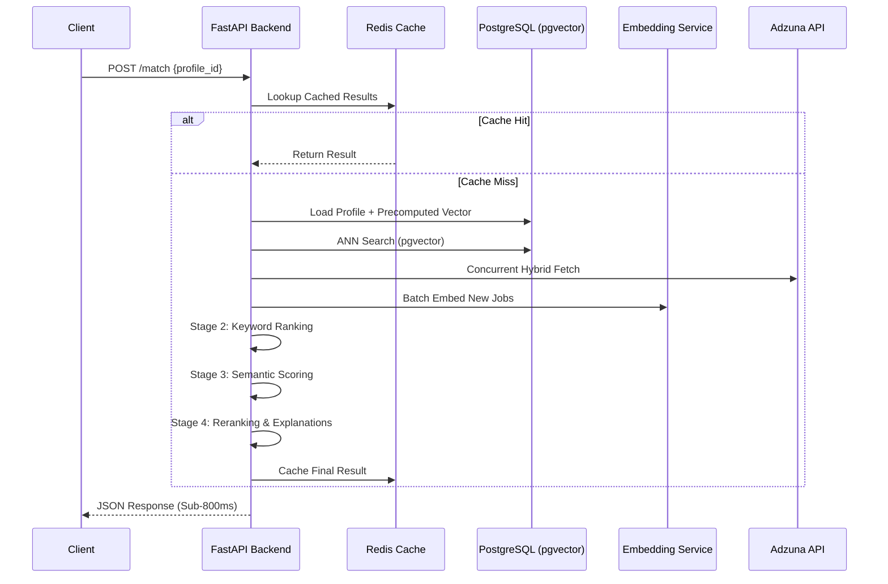

# 🚀 CareerMate AI: The Ultimate Matching Engine

[](https://fastapi.tiangolo.com/)
[](https://www.postgresql.org/)
[](https://redis.io/)
[](https://www.docker.com/)
[](https://opensource.org/licenses/MIT)

CareerMate AI is a state-of-the-art, high-concurrency job matching engine built to bridge the gap between candidate talent and employer needs. By utilizing a **Staged Hybrid Pipeline**, it delivers sub-second results even when scaling to millions of entries.

---

## 📑 Table of Contents
- [🔍 System Architecture](#-system-architecture)
- [🧩 Component Breakdown](#-component-breakdown)
- [🧠 The Engine: How It Works](#-the-engine-how-it-works)
- [🚀 Quick Start](#-quick-start)
- [⚙️ Environment Encyclopedia](#️-environment-encyclopedia)
- [📡 API Deep Dive](#-api-deep-dive)
- [🛡 Resilience & Ops](#-resilience--ops)

---

## 🔍 System Architecture

CareerMate AI is designed with **Resilience-First** principles. It handles external API failures, network latency, and high-dimensional vector search gracefully.

### Request Lifecycle


---

## 🧩 Component Breakdown

Understanding the codebase mapping:

| Directory/File | Responsibility |
| :--- | :--- |
| **`ai-service/main.py`** | Application bootstrap, middleware, and router registration. |
| **`routes/match.py`** | The `/match` endpoint logic (Pipeline Orchestrator). |
| **`routes/profile.py`** | CRUD for User Profiles with automatic embedding on save. |
| **`services/matching.py`** | The core logic. Manages stages from retrieval to ranking. |
| **`services/embedding.py`** | Unified embedding client with remote service + local fallbacks. |
| **`services/reranker.py`** | High-precision refinement using LLMs or weighted fallbacks. |
| **`services/ann_index.py`** | Manages vector indexing and retrieval via `pgvector`. |
| **`services/job_parser.py`** | LLM-based metadata extraction (Skills, Seniority, Industry). |
| **`models/job.py`** | SQLAlchemy model for jobs, including the `vector` type. |

---

## 🧠 The Engine: How It Works

### Mathematical Scoring Weights
The engine doesn't just "guess". It uses a strictly weighted algorithm for its **Hybrid Keyword Stage**:

- **Target Position Fit (45%)**: Semantic overlap between profile target and job title.
- **Hard Skill Alignment (35%)**: Exact and fuzzy match within the normalized skill set.
- **Seniority Proximity (10%)**: Distance-based scoring between experience levels.
- **Industry Relevance (10%)**: Matching industry vertical tags.

### Vector Search (Semantic Stage)
We utilize `sentence-transformers/all-MiniLM-L6-v2` to map text to a **384-dimensional space**.
- **Distance Metric**: Cosine Similarity.
- **Storage**: `pgvector` in PostgreSQL for persistent, queryable embeddings.
- **Optimization**: ANN retrieval ensures we only compare the most promising 50–100 candidates semantically, saving CPU cycles.

---

## 🚀 Quick Start

### 1. Zero-Install Launch (Docker)
The easiest way to get the full stack (API + DB + Redis + Embedding Svc) running:
```bash
docker compose up --build
```

### 2. Manual Setup
```bash
# Clone and setup environment
git clone https://github.com/YourRepo/CareerMate-AI.git
cp .env.example .env

# Install Backend
cd ai-service
pip install -r requirements.txt

# Migrate & Seed
python migrate.py
python main.py  # Entry point
```

---

## ⚙️ Environment Encyclopedia

| Variable | Default | Impact |
| :--- | :--- | :--- |
| `DATABASE_URL` | N/A | PostgreSQL connection string. |
| `REDIS_URL` | Optional | Enables result caching if provided. |
| `HF_TOKEN` | Optional | Required for Hugging Face embedding provider. |
| `REQUEST_TIMEOUT_MS` | `800` | Latency budget. If exceeded, skipping heavy stages. |
| `JOB_TTL_DAYS` | `14` | How long jobs persist before being purged as stale. |
| `FINAL_TOP_K` | `10` | The number of ranked recommendations returned to user. |
| `USE_LLM_RERANKER` | `false` | Enable/Disable expensive LLM calls for final ranking. |

---

## 📡 API Deep Dive

### `POST /match/`
Triggers the full pipeline. Supports loading profiles by ID or raw payloads.

**Request Schema:**
```json
{
  "profile_id": "uuid-123",
  "fetch_limit": 50,
  "country": "fr"
}
```

**Partial Response:**
```json
{
  "query": "Backend Developer",
  "latency_ms": { "total": 450, "embedding": 120, "db_query": 30 },
  "stage_counts": { "fetched": 50, "final": 10 },
  "jobs": [
    {
      "title": "Staff Engineer",
      "score": 0.94,
      "explanations": ["90% Skill overlap", "Seniority match"]
    }
  ]
}
```

---

## 🛡 Resilience & Ops

- **Degraded Mode**: If the database or external APIs are slow and exceed `REQUEST_TIMEOUT_MS`, the system automatically skips LLM reranking and heavy semantic ranking, returning the best available keyword-matched results.
- **Vector Backfilling**: Run `python backfill_job_embeddings.py` to process existing database rows that lack embeddings.
- **Auto-Cleanup**: A background process removes stale job listings, ensuring the index stays dense and relevant.

---

## 📄 License & Contribution
- Distributed under the **MIT License**.
- See **[CONTRIBUTING.md](CONTRIBUTING.md)** for development guidelines.

---

> Built with ❤️ by the CareerMate AI Team.
